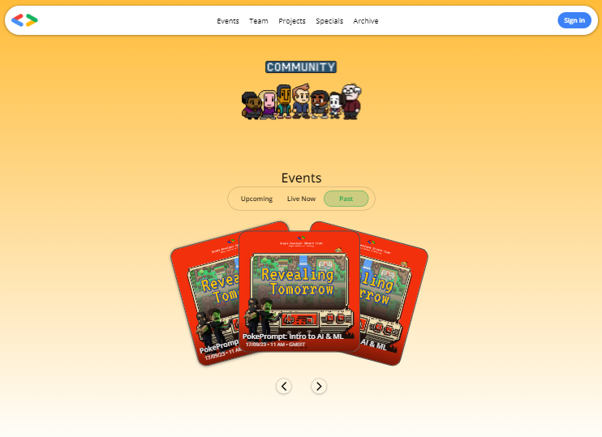
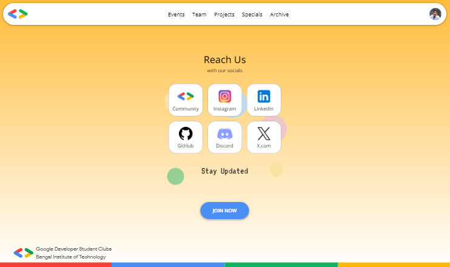
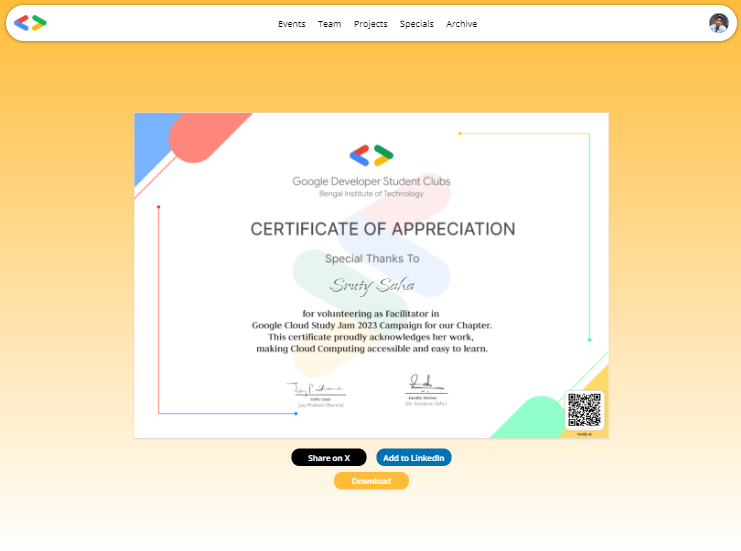
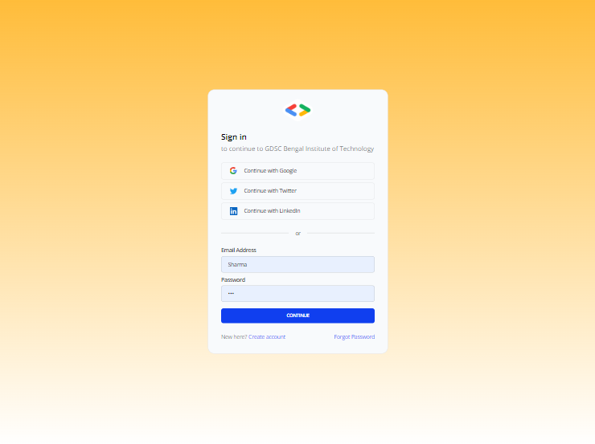

# Welcome to our GDSC Chapter page

A complete solution for handling everything about our **GDSC** for its members and organizers. On our campus, **[Bengal Institute of Technology](https://bitcollege.in)**, we have the honour to establish **[Google Developer Students Club](https://gdsc.community.dev)** for the first time. We love to see students and tech professionals are joining it and exploring their potential.

## Have a look...

**_view of home page_**

**_socials section_**

## Features

- An awesome design from our Graphics team.
- Look for events, projects, and archives.
- User specific details.
- Certificate verification with share options.

### Certificate Verification
The most useful feature which help us a lot to verify certificates shared to individuals appreciating effort.

***view of a verified certificate***
- View your certificate on our site.
- Share your achievement on socials.
- Download it if unable to find in your gallery.

### Sign in to personalize

***user sign up and login page***
- View your events related data, scoreboard, and contributions.
- Look and change your information saved with us.

## For Developers
We  have made it open source to help **GDSCs** around the globe. We are also looking forward for developers to come and contribute into. Please, read following sections to make it easier for you.
### Interface for devs
1. Fork and repo and clone the forked on local machine.
2. Go through contributing guidelines mentioned in [contribution guide](CONTRIBUTING.md).
3. Please adhere to our code of conduct through out interactions with this organization and  community members.
4. Chill !! Have a good one.